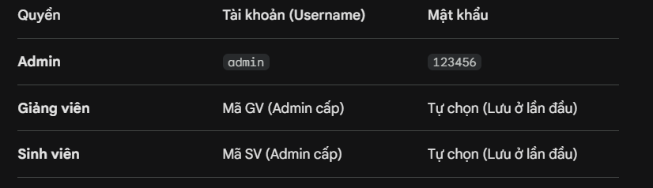

# Hệ Thống Quản Lý Sinh Viên & Giảng Viên

**Sinh Vien:**

1. Phạm Văn Xuân, MSV: 23810310450
   2.VŨ THANH TÙNG MSV: 23810310114
   3.NGUYỄN ĐỨC ANH MSV: 23810310393

---

Dự án là một hệ thống quản lý giáo dục toàn diện, cho phép Admin quản lý nhân sự, Giảng viên quản lý điểm số và Sinh viên theo dõi lộ trình học tập.

---

## Yêu cầu môi trường

Để chạy được dự án này, máy tính của bạn cần cài đặt các thành phần sau:

1. **XAMPP (Phiên bản 8.0 trở lên):** - Sử dụng **Apache** để làm Web Server (hoặc chạy qua Live Server của VS Code).
   - Sử dụng **MySQL** để quản lý cơ sở dữ liệu.
2. **Node.js (Phiên bản 14.x trở lên):** Để chạy máy chủ Backend.
3. **Trình duyệt web:** Chrome, Edge hoặc Firefox.

---

## 🚀 Hướng dẫn cài đặt và khởi chạy

### Bước 1: Thiết lập Cơ sở dữ liệu (MySQL)

1. Mở **XAMPP Control Panel** và Start **Apache** và **MySQL**.
2. Truy cập đường dẫn: `http://localhost/phpmyadmin`.
3. Tạo một Database mới tên là: `quanlysinhvien`.
4. Chọn Database vừa tạo, vào tab **SQL**, copy nội dung tệp `database.sql` đính kèm bên dưới và nhấn **Go**.

### Bước 2: Cài đặt thư viện Backend

1. Mở thư mục dự án bằng **VS Code**.
2. Mở Terminal (`Ctrl + ~`) và chạy lệnh sau để cài đặt các thư viện cần thiết:
   ```bash
   npm install express mysql2 cors
   ```

### Bước 3: Khởi chạy dự án

1. Trong Terminal, chạy lệnh để bật máy chủ: node server.js
   Lưu ý: Giữ Terminal này luôn chạy trong suốt quá trình sử dụng web.
2. Mở file dangnhap/login.html bằng trình duyệt (hoặc qua Live Server).

### Tài khoản đăng nhập mặc định

Hệ thống sử dụng cơ chế tự động cấp tài khoản cho Sinh viên và Giảng viên ở lần đầu đăng nhập.


### Cấu trúc thư mục

project-root/
│
├── admin/ # Chức năng Quản trị viên
│ ├── admin.html # Giao diện quản lý Khoa, Lớp, SV, GV, Môn học, Lịch học
│ ├── admin.js # Xử lý API Thêm/Sửa/Xóa
│ └── admin.css # Giao diện màu Xanh dương chủ đạo
│
├── giangvien/ # Chức năng cho Giảng viên
│ ├── thongtin.html # Xem hồ sơ giảng viên
│ ├── quanlybangdiem.html # Nhập điểm theo lớp và môn học
│ └── giangvien.css # Giao diện đồng bộ màu Xanh dương
│
├── sinhvien/ # Chức năng cho Sinh viên
│ ├── trangchu.html # Xem hồ sơ cá nhân
│ ├── lichhoc.html # Xem thời khóa biểu dạng lưới (Thứ 2 - Thứ 7)
│ ├── ketquahoctap.html # Xem bảng điểm và tính GPA tự động
│ └── trangchu.css # CSS dùng chung cho phân hệ SV
│
├── dangnhap/ # Phân hệ đăng nhập
│ ├── login.html
│ ├── login.js # Xử lý điều hướng theo Quyền (Role)
│ └── style.css
│
└── server.js # Node.js API Server (Kết nối MySQL)

### 2. Tệp Cơ sở dữ liệu tổng hợp (database.sql)

Bạn hãy copy toàn bộ nội dung dưới đây để thực hiện Import vào MySQL. Đây là cấu trúc đã được tối ưu hóa các ràng buộc khóa ngoại để đảm bảo an toàn dữ liệu:

```sql
-- 1. Tạo Database
CREATE DATABASE IF NOT EXISTS `quanlysinhvien` DEFAULT CHARACTER SET utf8mb4 COLLATE utf8mb4_general_ci;
USE `quanlysinhvien`;

-- 2. Tạo bảng Khoa
CREATE TABLE `Khoa` (
  `MaKhoa` varchar(20) PRIMARY KEY,
  `TenKhoa` varchar(100) NOT NULL
) ENGINE=InnoDB;

-- 3. Tạo bảng Lớp
CREATE TABLE `Lop` (
  `MaLop` varchar(20) PRIMARY KEY,
  `TenLop` varchar(100) NOT NULL,
  `MaKhoa` varchar(20),
  FOREIGN KEY (`MaKhoa`) REFERENCES `Khoa`(`MaKhoa`) ON DELETE SET NULL
) ENGINE=InnoDB;

-- 4. Tạo bảng Sinh Viên
CREATE TABLE `SinhVien` (
  `MaSV` varchar(20) PRIMARY KEY,
  `TenSV` varchar(100) NOT NULL,
  `NgaySinh` date,
  `GioiTinh` varchar(10),
  `MaLop` varchar(20),
  FOREIGN KEY (`MaLop`) REFERENCES `Lop`(`MaLop`) ON DELETE SET NULL
) ENGINE=InnoDB;

-- 5. Tạo bảng Giảng Viên
CREATE TABLE `GiangVien` (
  `MaGV` varchar(20) PRIMARY KEY,
  `TenGV` varchar(100) NOT NULL,
  `Email` varchar(100),
  `MaKhoa` varchar(20),
  FOREIGN KEY (`MaKhoa`) REFERENCES `Khoa`(`MaKhoa`) ON DELETE SET NULL
) ENGINE=InnoDB;

-- 6. Tạo bảng Tài Khoản (Đăng nhập)
CREATE TABLE `TaiKhoan` (
  `Username` varchar(50) PRIMARY KEY,
  `Password` varchar(255) NOT NULL,
  `Quyen` varchar(20) NOT NULL
) ENGINE=InnoDB;

-- 7. Tạo bảng Môn Học
CREATE TABLE `MonHoc` (
  `MaMH` varchar(20) PRIMARY KEY,
  `TenMH` varchar(100) NOT NULL,
  `SoTinChi` int(11) NOT NULL
) ENGINE=InnoDB;

-- 8. Tạo bảng Lịch Học
CREATE TABLE `LichHoc` (
  `MaLich` int(11) AUTO_INCREMENT PRIMARY KEY,
  `MaLop` varchar(20),
  `MaMH` varchar(20),
  `MaGV` varchar(20),
  `PhongHoc` varchar(50),
  `Thu` varchar(20),
  `CaHoc` varchar(20),
  FOREIGN KEY (`MaLop`) REFERENCES `Lop`(`MaLop`) ON DELETE CASCADE,
  FOREIGN KEY (`MaMH`) REFERENCES `MonHoc`(`MaMH`) ON DELETE CASCADE,
  FOREIGN KEY (`MaGV`) REFERENCES `GiangVien`(`MaGV`) ON DELETE CASCADE
) ENGINE=InnoDB;

-- 9. Tạo bảng Bảng Điểm
CREATE TABLE `BangDiem` (
  `MaSV` varchar(20),
  `MaMH` varchar(20),
  `Diem` float,
  PRIMARY KEY (`MaSV`, `MaMH`),
  FOREIGN KEY (`MaSV`) REFERENCES `SinhVien`(`MaSV`) ON DELETE CASCADE,
  FOREIGN KEY (`MaMH`) REFERENCES `MonHoc`(`MaMH`) ON DELETE CASCADE
) ENGINE=InnoDB;

-- 10. Chèn dữ liệu mẫu ban đầu
INSERT INTO `TaiKhoan` (`Username`, `Password`, `Quyen`) VALUES ('admin', '123456', 'Admin');

-- Chèn mẫu Khoa và Lớp để hệ thống sẵn sàng hoạt động
INSERT INTO `Khoa` (`MaKhoa`, `TenKhoa`) VALUES ('CNTT', 'Công nghệ thông tin');
INSERT INTO `Lop` (`MaLop`, `TenLop`, `MaKhoa`) VALUES ('CNTT1', 'Lớp CNTT Khóa 1', 'CNTT');
```
